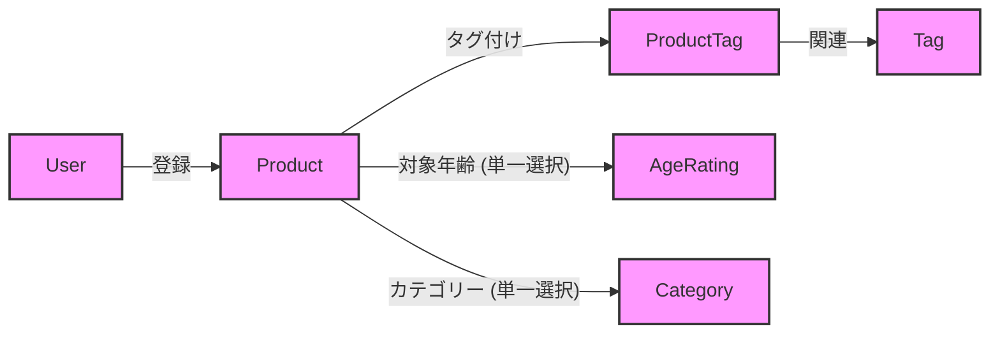

# 商品属性追加と検索機能実装計画

## 概要

本計画は、既存の商品タグ機能に加え、商品の「対象年齢」「カテゴリー」「主要機能」情報を登録・検索可能にするための実装手順を定義する。対象年齢とカテゴリーは新しいリレーショナルテーブルで管理し、主要機能は既存のタグ機能を利用するハイブリッドアプローチを採用する。

## データモデル変更案

対象年齢とカテゴリーを管理するための新しいモデルを追加し、Productモデルと関連付ける。主要機能はTagモデルをそのまま利用する。



### `prisma/schema.prisma` への追加内容（予定）

```prisma
// 対象年齢モデル
model AgeRating {
  id     String    @id @default(cuid())
  name   String    @unique // 例: '全年齢', 'R-15', 'R-18', 'NSFW'
  products Product[]
}

// カテゴリーモデル
model Category {
  id     String    @id @default(cuid())
  name   String    @unique // 例: 'アバター', '衣装', 'アクセサリー'
  products Product[]
}

// Product モデルへの関連付け追加（既存のProductモデルに追記）
model Product {
  // ... 既存フィールド ...

  ageRatingId String?
  ageRating   AgeRating? @relation(fields: [ageRatingId], references: [id])

  categoryId String?
  category   Category? @relation(fields: [categoryId], references: [id])

  // ... 既存フィールド ...
}
```

## 実装ステップ

1.  **データモデルの定義**:
    *   `prisma/schema.prisma` に `AgeRating` および `Category` モデルを追加し、`Product` モデルとの間にリレーションを定義する。
    *   主要機能は既存の `Tag` モデルを利用するため、新しいモデルは作成しない。
2.  **データベースマイグレーション**:
    *   `npx prisma migrate dev` コマンドを実行し、データベーススキーマを更新する。
3.  **データ登録機能の実装**:
    *   商品の登録・編集画面 (`src/app/register-item/page.tsx` など) に、対象年齢とカテゴリーを選択する UI を追加する。
    *   主要機能については、既存のタグ入力 UI を利用する。
    *   これらの情報を受け取り、データベースに保存するための API エンドポイント (`src/app/api/items/create/route.ts`, `src/app/api/items/update/route.ts` など) を修正する。
4.  **検索機能の実装**:
    *   検索ページ (`src/app/search/page.tsx`) に、対象年齢とカテゴリーで絞り込むための UI を追加する。
    *   主要機能については、既存のタグ検索 UI を利用する。
    *   これらの情報を検索クエリとして商品検索 API (`src/app/api/products/route.ts`) に渡すように修正する。
    *   商品検索 API を修正し、受け取った条件で商品をフィルタリングできるようにする。
    *   対象年齢、カテゴリー、主要機能（タグ）のそれぞれについて、「よく使われるであろうクエリをボタンを押すことで検索クエリに追加できるようにする」UI/UX を実装する。これは、`src/components/search/ProductSearch.tsx` などのコンポーネントを修正することになる。

## 今後の進め方

計画にご同意いただけましたら、Codeモードに切り替えてデータモデルの定義から実装を開始します。