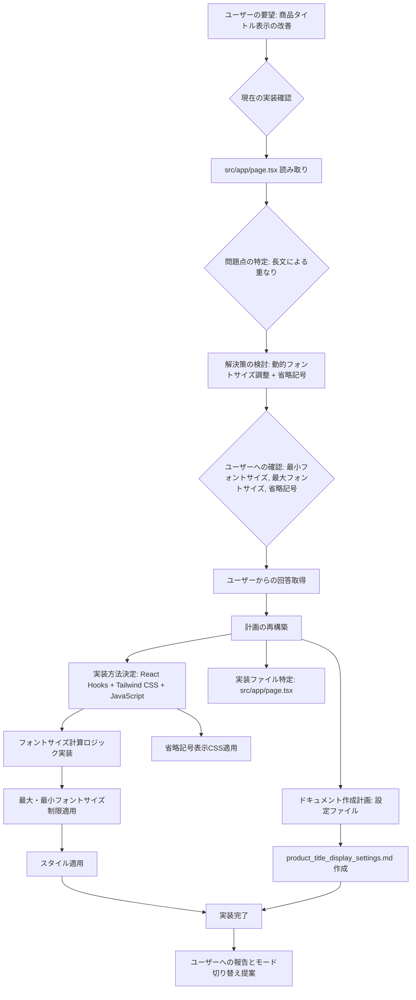

# 商品タイトル表示改善計画

## 概要
トップページの商品タイトルが長文の場合に他の要素に重なってしまう問題を解決するため、テキストの長さに応じてフォントサイズを自動調整し、所定の領域に収まるようにする。タイトルが短い場合は、事前に定めた最大フォントサイズより大きくならないようにする。テキストが最小フォントサイズでも収まらない場合は、省略記号（...）を表示する。

## 要件
- 商品タイトルが長文の場合、フォントサイズを自動的に小さくして所定の領域に収める。
- タイトルが短い場合、フォントサイズが最大フォントサイズを超えないようにする。
- テキストが最小フォントサイズでも収まらない場合、省略記号（...）を表示する。
- 最大フォントサイズ、最小フォントサイズ、および関連設定は、ユーザーが調整できるようにドキュメント化する。

## 計画

1.  **実装方法:**
    *   ReactのHooks (`useState`, `useEffect`, `useRef`) を使用して、商品タイトルの要素とコンテナの幅を取得し、動的にフォントサイズを計算する。
    *   計算したフォントサイズをインラインスタイルとして`<h3>`要素に適用する。
    *   Tailwind CSSを使用して、コンテナの幅や最大・最小フォントサイズの上限などの静的なスタイルを定義する。
    *   テキストが収まらない場合の省略記号表示は、CSSの `text-overflow: ellipsis;`, `overflow: hidden;`, `white-space: nowrap;` を使用して実現する。

2.  **実装詳細:**
    *   `src/app/page.tsx`内の商品タイトルを表示する`<h3>`タグにrefを持たせる。
    *   `useEffect`フック内で、refを持つ要素の幅とテキストの長さを監視する。
    *   監視対象の要素の幅やテキストの長さに変更があった場合に、フォントサイズを計算する関数を実行する。
    *   フォントサイズ計算関数内で、要素の幅とテキストの長さを比較し、適切なフォントサイズを算出する。この際、ユーザーが設定する最大・最小フォントサイズの範囲内に収まるように制限をかける。
    *   計算されたフォントサイズを`<h3>`要素のstyleプロパティに適用する。
    *   `<h3>`要素に、省略記号表示のためのCSSプロパティ（`text-overflow: ellipsis;`, `overflow: hidden;`, `white-space: nowrap;`）を適用するTailwind CSSクラスを追加する。

3.  **ドキュメント作成:**
    *   最大フォントサイズ、最小フォントサイズ、および必要に応じて省略記号表示に関する設定方法を記述したMarkdownドキュメントファイル `plan/product_title_display_settings.md` を作成する。
    *   ドキュメントには、各設定項目の説明と、ユーザーが値を調整する際の手順を記載する。

4.  **対象ファイル:**
    *   `src/app/page.tsx` (実装)
    *   `plan/product_title_display_settings.md` (設定ドキュメント)

## Mermaid図



## 設定ドキュメント（plan/product_title_display_settings.md）の内容案

```markdown
# 商品タイトル表示設定

このドキュメントでは、トップページの商品タイトル表示に関する設定について説明します。

## 設定項目

- **最大フォントサイズ (Max Font Size):**
  - タイトルが短い場合に適用されるフォントサイズの最大値です。
  - デフォルト値: [初期値をここに記載]
  - 調整方法: `src/app/page.tsx` 内のフォントサイズ計算ロジックを参照し、適切な値を設定してください。

- **最小フォントサイズ (Min Font Size):**
  - タイトルが長い場合にフォントサイズを小さくする際の最小値です。
  - デフォルト値: [初期値をここに記載]
  - 調整方法: `src/app/page.tsx` 内のフォントサイズ計算ロジックを参照し、適切な値を設定してください。

- **省略記号表示 (Ellipsis Display):**
  - テキストが最小フォントサイズでも領域に収まらない場合に省略記号（...）を表示するかどうかの設定です。
  - 現在の実装では常に表示されます。
  - 調整方法: `src/app/page.tsx` 内の該当するCSSスタイル（`text-overflow`, `overflow`, `white-space`）を変更してください。

## 設定値の調整方法

1.  `src/app/page.tsx` ファイルを開きます。
2.  フォントサイズを計算している部分のコードを探します。
3.  最大フォントサイズ、最小フォントサイズとして設定されている変数の値を変更します。
4.  変更を保存し、アプリケーションを再ビルドまたはリロードして表示を確認します。

これらの設定値は、デザインや表示されるタイトルの平均的な長さに応じて適宜調整してください。