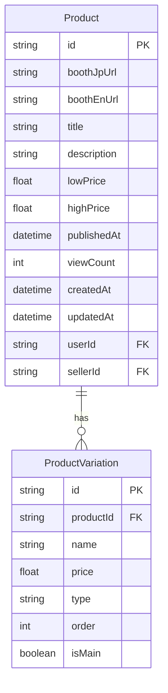

# Booth.pm商品の価格バリエーション表示機能実装計画

## 現状分析

Booth.pmの商品ページを解析した結果、商品には複数の価格バリエーションが存在することが確認できました。例えば、サンプルとして確認した「デルタフレア」という商品には以下のようなバリエーションがあります：

1. 【PC】デルタフレア - DELTAFLAIR (¥6,000)
2. 【Quest】デルタフレア - DELTAFLAIR (¥2,500)
3. 【akazukin】DLC (¥1,200)
4. 【SHOGGOTH】DLC (¥1,000)
5. 【DAGON】DLC (¥1,000)
6. 【HASTUR】DLC (¥1,000)
7. 【ACSSESSORIESv1.5】DLC (¥1,000)

現在のPolySeekのデータベーススキーマでは、商品の価格情報は`lowPrice`と`highPrice`の2つのフィールドのみで保存されており、各バリエーションの詳細情報（名前と価格）は保存されていません。

ユーザーからの要望として、「複数バリエーションの価格がある場合、価格をクリックするとドロップダウンでそれぞれの価格と商品名を表示できるようにしたい」という点があります。これは、一部の販売者が利用規約を無料の商品として登録しておき、商品本体は高額な価格設定にすることで安く見せる手法に対応するためです。

## データベース設計の変更

### 既存フィールドの維持

`Product`モデルの`lowPrice`と`highPrice`フィールドは維持します。これらのフィールドは価格範囲での検索に非常に効率的であり、クエリのパフォーマンスを向上させます。また、既存のコードとの互換性も維持できます。

### 新しいモデル: `ProductVariation`

各商品バリエーションの詳細情報を保存するための新しいモデルを追加します。



### Prismaスキーマの変更

```prisma
// 商品バリエーションテーブル
model ProductVariation {
  id          String    @id @default(cuid())
  productId   String
  name        String    // バリエーション名（例：「【PC】デルタフレア - DELTAFLAIR」）
  price       Float     // バリエーション価格
  type        String    @default("download") // 商品タイプ（例：「ダウンロード商品」）
  order       Int       @default(0) // 表示順序
  isMain      Boolean   @default(false) // メインバリエーションフラグ
  createdAt   DateTime  @default(now())
  updatedAt   DateTime  @updatedAt

  product     Product   @relation(fields: [productId], references: [id], onDelete: Cascade)

  @@index([productId])
  @@index([productId, order]) // 商品ごとの順序付きバリエーション取得用
}

// Productモデルに関連を追加
model Product {
  // 既存のフィールド...
  
  // 新しい関連
  variations  ProductVariation[]
}
```

## データ取得・保存の変更

### 1. Booth.pmからのデータ取得処理の変更

`src/app/api/items/route.ts`のスクレイピング処理を修正して、各バリエーションの情報を取得します。

```typescript
// バリエーション情報を取得
const variations: { name: string; price: number; type: string; order: number; isMain: boolean }[] = [];

// HTMLからバリエーション情報を抽出
$('.variations .variation-item').each((i, elem) => {
  const name = $(elem).find('.variation-name').text().trim();
  const priceText = $(elem).find('.variation-price').text().trim();
  const price = parseFloat(priceText.replace('¥', '').replace(',', '').trim());
  const type = $(elem).find('.u-tpg-caption1').text().trim();
  
  variations.push({
    name,
    price,
    type,
    order: i,
    isMain: i === 0 // 最初のバリエーションをメインとする
  });
});

// 最低価格と最高価格を計算
const prices = variations.map(v => v.price);
const lowPrice = Math.min(...prices);
const highPrice = Math.max(...prices);
```

### 2. 商品作成APIの変更

`src/app/api/items/create/route.ts`を修正して、バリエーション情報も保存するようにします。

```typescript
// 商品を作成
const product = await prisma.product.create({
  data: {
    boothJpUrl,
    boothEnUrl,
    title,
    description,
    lowPrice,
    highPrice,
    publishedAt,
    userId,
    sellerId: seller.id,
    // バリエーション情報も保存
    variations: {
      create: variations.map(v => ({
        name: v.name,
        price: v.price,
        type: v.type,
        order: v.order,
        isMain: v.isMain
      }))
    },
    // 他のデータ...
  },
  include: {
    variations: true,
    // 他のインクルード...
  }
});
```

### 3. 商品更新APIの変更

`src/app/api/items/update/route.ts`も同様に修正して、バリエーション情報を更新するようにします。

## フロントエンド表示の変更

### 1. 商品一覧ページの変更

`src/app/page.tsx`の価格表示部分を修正して、複数バリエーションがある場合はドロップダウンで表示できるようにします。

```tsx
// 価格表示コンポーネント
const PriceDisplay = ({ product }) => {
  const [isOpen, setIsOpen] = useState(false);
  const hasMultipleVariations = product.highPrice > product.lowPrice;

  return (
    <div className="relative">
      <button 
        className={`text-gray-700 font-bold flex items-center ${hasMultipleVariations ? 'cursor-pointer' : ''}`}
        onClick={() => hasMultipleVariations && setIsOpen(!isOpen)}
      >
        ¥{product.lowPrice.toLocaleString()}
        {hasMultipleVariations && (
          <>
            {' ~ '}¥{product.highPrice.toLocaleString()}
            <svg className="w-4 h-4 ml-1" fill="none" stroke="currentColor" viewBox="0 0 24 24" xmlns="http://www.w3.org/2000/svg">
              <path strokeLinecap="round" strokeLinejoin="round" strokeWidth={2} d="M19 9l-7 7-7-7" />
            </svg>
          </>
        )}
      </button>
      
      {isOpen && product.variations && (
        <div className="absolute z-10 mt-1 w-48 bg-white rounded-md shadow-lg py-1">
          {product.variations.map((variation) => (
            <div key={variation.id} className="px-4 py-2 hover:bg-gray-100">
              <div className="font-medium">{variation.name}</div>
              <div className="text-gray-700">¥{variation.price.toLocaleString()}</div>
            </div>
          ))}
        </div>
      )}
    </div>
  );
};
```

### 2. APIエンドポイントの変更

`src/app/api/products/latest/route.ts`を修正して、バリエーション情報も返すようにします。

```typescript
// 最新の商品を取得
const products = await prisma.product.findMany({
  orderBy: {
    createdAt: 'desc',
  },
  include: {
    images: {
      where: {
        isMain: true,
      },
      select: {
        imageUrl: true,
      },
      take: 1,
    },
    productTags: {
      include: {
        tag: {
          select: {
            name: true,
          },
        },
      },
      take: 7,
    },
    variations: {
      orderBy: {
        order: 'asc',
      },
    },
  },
});

// レスポンスデータをフォーマット
const formattedProducts = products.map((product) => ({
  id: product.id,
  title: product.title,
  lowPrice: product.lowPrice,
  highPrice: product.highPrice,
  mainImageUrl: product.images.length > 0 ? product.images[0].imageUrl : null,
  tags: product.productTags.map((pt) => pt.tag.name),
  variations: product.variations.map(v => ({
    id: v.id,
    name: v.name,
    price: v.price,
  })),
}));
```

## 価格範囲検索の実装

`lowPrice`と`highPrice`フィールドを維持することで、価格範囲での検索を効率的に実装できます。例えば：

```typescript
// 価格範囲での検索
const products = await prisma.product.findMany({
  where: {
    lowPrice: { gte: minPrice },
    highPrice: { lte: maxPrice }
  },
  // 他の条件...
});
```

これにより、各商品のすべてのバリエーションをチェックする必要がなく、クエリのパフォーマンスが向上します。

## ストレージ消費量の見積もり

新しい`ProductVariation`モデルを追加することによるデータベースストレージの増加を見積もります。

1つのバリエーションレコードのサイズを概算すると：
- id (cuid): 約25バイト
- productId (cuid): 約25バイト
- name (文字列): 平均50バイト
- price (浮動小数点): 8バイト
- type (文字列): 平均15バイト
- order (整数): 4バイト
- isMain (ブール値): 1バイト
- createdAt (日時): 8バイト
- updatedAt (日時): 8バイト
- インデックスとオーバーヘッド: 約50バイト

合計: 約194バイト/バリエーション

平均的な商品が3つのバリエーションを持つと仮定すると、1商品あたり約582バイトの追加ストレージが必要になります。

10,000商品の場合：約5.82MB
100,000商品の場合：約58.2MB
1,000,000商品の場合：約582MB

これは比較的小さなストレージ増加であり、データベースのパフォーマンスに大きな影響を与えることはないと考えられます。

## 実装ステップ

1. Prismaスキーマに`ProductVariation`モデルを追加
2. マイグレーションを実行して新しいテーブルを作成
3. Booth.pmからのデータ取得処理を修正して、バリエーション情報も取得するようにする
4. 商品作成・更新APIを修正して、バリエーション情報も保存するようにする
5. フロントエンドの価格表示コンポーネントを実装
6. APIエンドポイントを修正して、バリエーション情報も返すようにする
7. テストとデバッグ

## まとめ

この計画を実装することで、Booth.pmの商品の複数価格バリエーションを適切に保存し、ユーザーに分かりやすく表示することができます。これにより、「安い価格バリエーションの商品を作成し、商品本体は高額な価格設定にすることで安く見せる手法」に対応し、ユーザーの不満を解消することができます。

`lowPrice`と`highPrice`フィールドを維持することで、価格範囲での検索も効率的に実装できます。データベースのストレージ消費量の増加は比較的小さく、パフォーマンスへの影響も最小限に抑えられると考えられます。