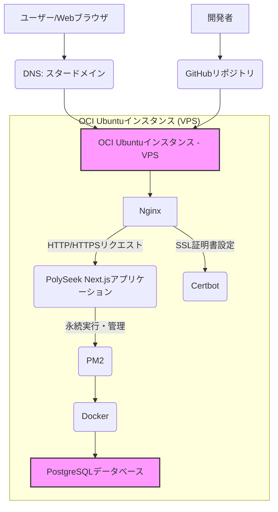

# PolySeek 本番環境システム構成図

## 概要
このドキュメントは、PolySeekアプリケーションの本番環境におけるシステム構成を視覚的に表現し、主要なコンポーネントとその相互作用を説明します。

## システム構成図

## コンポーネントの説明

*   **ユーザー/Webブラウザ**: PolySeekアプリケーションにアクセスするエンドユーザー。
*   **DNS (スタードメイン)**: ドメイン名 (`polyseek.jp`) をVPSのパブリックIPアドレスに解決します。
*   **OCI Ubuntuインスタンス (VPS)**: アプリケーションがデプロイされる仮想プライベートサーバー。
*   **Nginx**: リバースプロキシとして機能し、ユーザーからのHTTP/HTTPSリクエストを受け付け、Next.jsアプリケーションに転送します。SSL証明書の終端も行います。
*   **Certbot**: Let's EncryptからSSL証明書を自動で取得・更新し、Nginxに設定します。
*   **PolySeek Next.jsアプリケーション**: Next.jsで構築されたPolySeekのフロントエンドおよびバックエンドAPI。
*   **PM2**: Node.jsアプリケーション (Next.js) を永続的に実行し、クラッシュ時の自動再起動やログ管理を行います。
*   **Docker**: PostgreSQLデータベースをコンテナとして実行するためのプラットフォーム。
*   **PostgreSQLデータベース**: アプリケーションのデータを保存するリレーショナルデータベース。DockerコンテナとしてVPS上で動作します。
*   **開発者**: コードの変更を行い、GitHubリポジトリにプッシュします。
*   **GitHubリポジトリ**: PolySeekのソースコードが管理される中央リポジトリ。本番サーバーはここから最新のコードをプルします。